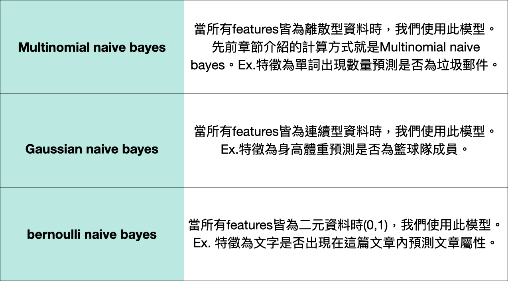

# 第一屆《 NLP 自然語言機器學習馬拉松 》

## Part 1 : NLP 經典機器學習
### Python NLP 程式基礎
- [Day 1 ~ 4 : Python 文字處理函數介紹、正規表達式](#day-1--4--python-文字處理函數介紹正規表達式)

### 詞彙與分詞技術
- [Day 5 : NLP 中文斷詞概念](#day-5--nlp-中文斷詞概念)
    - [Trie 樹](#trie-樹)
    - [隱馬可夫模型 HMM](#隱馬可夫模型-hmm)
    - [維特比動態規劃演算法 Viterbi](#維特比動態規劃演算法-viterbi)
- [Day 6 : 使用 Jieba 進行中文斷詞](#day-6--使用-jieba-進行中文斷詞)
- [Day 7 : 使用 CkipTagger 進行繁體中文斷詞](#day-7--使用-ckiptagger-進行繁體中文斷詞)
- [Day 8 : 基礎語言模型：N-Gram](#day-8--基礎語言模型n-gram)
    - [Bigram 模型](#bigram-模型)
- [Day 9 : 基礎語言模型：N-Gram](#day-9--基礎語言模型n-gram)

### NLP詞性標註方法
- [Day 10 - 11: 詞性標註 (POS Tagging)](#day-10---11-詞性標註-pos-tagging)

### 文字預處理與詞向量技術
- [Day 12 : 詞袋模型 (Bag-of-words)](#day-12--詞袋模型-bag-of-words)
    - [步驟](#步驟)
    - [優點](#優點)
    - [缺點](#缺點)
- [Day 13 : 詞幹/詞條提取](#day-13--詞幹詞條提取)
    - [優點](#優點-1)
    - [缺點](#缺點-1)
    - [Stemming](#stemming)
    - [Lemmatization](#lemmatization)
    - [SOTA model](#sota-model)
- [Day 14 : 文字預處理](#day-14--文字預處理)
    - [預處理順序整理](#預處理順序整理)
    - [預測](#預測)
- [Day 15 : TF-IDF](#day-15--tf-idf)
    - [詞頻（term frequency，TF)](#詞頻term-frequencytf)
    - [逆向檔案頻率（inverse document frequency，IDF)](#逆向檔案頻率inverse-document-frequencyidf)
- [Day 16 - 17: 計數方法詞向量介紹 & 實作](#day-16---17-計數方法詞向量介紹--實作)
    - [詞庫法](#詞庫法)
    - [計數法 (One-Hot Encoding)](#計數法-one-hot-encoding)
    - [共現矩陣](#共現矩陣)
    - [點間互資訊 (Pointwise Mutual Information, PMI)](#點間互資訊-pointwise-mutual-information-pmi)
    - [正向點間互資訊(PPMI)](#正向點間互資訊ppmi)
    - [奇異值分解(SVD)](#奇異值分解svd)
    - [餘弦相似度(Cosine similarity)](#餘弦相似度cosine-similarity)

### NLP 與經典機器學習模型
- [Day 18 : K-近鄰演算法 - 1](#day-18--k-近鄰演算法---1)
    - [Supervised Learning (監督式學習)](#supervised-learning-監督式學習)
    - [Unsupervised Learning (非監督式學習)](#unsupervised-learning-非監督式學習)
- [Day 19 : K-近鄰演算法 - 2](#day-19--k-近鄰演算法---2)
    - [K-fold (Cross-validation)](#k-fold-cross-validation)
- [Day 20 : KNN 實作](#day-20--knn-實作)
    - [資料讀取](#資料讀取)
    - [資料清理](#資料清理)
    - [文字轉向量](#文字轉向量)
    - [KNN 模型導入與參數設置](#knn-模型導入與參數設置)
    - [模型驗證](#模型驗證)
    - [混淆矩陣 (Confusion matrix)](#混淆矩陣-confusion-matrix)
    - [K-fold 尋找適合 K 值](#k-fold-尋找適合-k-值)
- [Day 21 : Naive Bayes 原理](#day-21--naive-bayes-原理)
- [Day 22 : 手刻 Naive Bayes](#day-21--手刻-Naive-Bayes)
    - [Functions](#functions)
        - [`tokenize(message)`](#tokenizemessage)
        - [`count_words(training_set)`](#count_wordstraining_set)
        - [`word_probabilities(counts, total_spams, total_non_spams, k=0.5)`](#word_probabilitiescounts-total_spams-total_non_spams-k05)
        - [`spam_probability(word_probs, message, spam_prob, ham_prob)`](#spam_probabilityword_probs-message-spam_prob-ham_prob)
    - [下溢](#下溢)
- [Day 23 : Naive Bayes 實作](#day-23--naive-bayes-實作)
    - [優點](#優點-2)
    - [缺點](#缺點-2)
- [Day 24 : 決策樹演算法 (Decision Tree)](#day-24--決策樹演算法-decision-tree)
    - [監督式學習](#監督式學習)
    - [決策樹](#決策樹)
        - [常見資訊量有兩種](#常見資訊量有兩種)
        - [Feature Importance](#feature-importance)
        - [優點](#優點)
        - [缺點](#缺點)
- [Day 25 : 隨機森林演算法 (Random Forest)](#day-25--隨機森林演算法-random-forest)
    - [決策樹的限制](#決策樹的限制)
    - [集成學習 Ensemble Learning](#集成學習-ensemble-learning)
    - [Bagging 算法](#bagging-算法)
    - [隨機森林優缺點](#隨機森林優缺點)

<br>

---
<br>

## Day 1 ~ 4 : Python 文字處理函數介紹、正規表達式

## Day 5 : NLP 中文斷詞概念
### Trie 樹
### 隱馬可夫模型 HMM
### 維特比動態規劃演算法 Viterbi

## Day 6 : 使用 Jieba 進行中文斷詞
```python
set_dictionary() 
load_userdict() 

add_word()     # 動態加入字典
suggest_freq() # 動態調整詞頻
posseg.cut()   # 詞性標註
tokenize()     # 斷詞位置標註
```

## Day 7 : 使用 CkipTagger 進行繁體中文斷詞
* 安裝 ckiptagger, tensorflow, gdown (Google Drive 下載)
```python
WS  # 斷詞
POS # 詞性標註
NER # 實體辨識

construct_dictionary(dict_word2weight)
recommend_dictionary # 使用建議字典
coerce_dictionary    # 使用強制字典（優先）
```

## Day 8 : 基礎語言模型：N-Gram
### Bigram 模型
* `P(word1|start) * P(word2|word1) ... * P(end|word_x)`
    
## Day 9 : 基礎語言模型：N-Gram
* 以 Python 建立 N-Gram 模型
* 以 NLTK 套件實作 N-Gram
* 找出所有中文字 & 數字的方法
    ```python
    re.findall(r'[\u4E00-\u9FA50-9]')
    ```
* `namedtuple(Name, attr)` 的使用
* `sorted(iter_obj, key=lambda x: x[index])` 代表設定 x[index] 為排序依據

## Day 10 - 11: 詞性標註 (POS Tagging)
* 決定單詞的詞性前，除了考慮單詞本身，也要考慮前後單詞與整句話
* 通常一個單詞會包含多種詞性
* `詞幹提取(stemming)`：去除詞綴得到詞根
* `Closed Class`：相對固定的詞類，不太會有新的詞類出現
    * `pronouns`: she, he, I
    * `preposition`: on, under, by
* `Open Class`：容易有新詞被創造
    * 如 `Noun`、`Verb`、`Adjective`等等
* `jieba.cut()`回傳一個 Generator，記得使用 `join` 來 `print`

## Day 12 : 詞袋模型 (Bag-of-words)
### 步驟
1. 資料集包含正反面評價 1000 則
2. 所有的單詞建一個字典 (每個單詞有對應的 index，不限順序，但不可改變)
3. 假設字典大小為 3000 (也就是 3000 個單詞)，每則評價視為一袋，要用一個向量表示這個評價
5. 先建一個 3000 維皆為 0 的向量 (ex.[0, 0, 0,......])，再將這個評價內有出現的單詞取出，找到對應的 index，將向量中這個位置的值 +1
6. 若一個評價中找到兩個 good，而 good 對應到的 index 為 5，所以我們就在向量 [5] 的位置 +2，變為 [0, 0, 0, 0 , 0, 2,.....]
### 優點
* 直觀，操作容易，並且不需要任何預訓練模型，可套用在任何需要將文字轉向量的任務上
### 缺點
* 無法表達前後語意關係
* 無法呈現單字含義：許多單字有多種不同含義，如我要買蘋果手機跟我要去菜市場買蘋果，兩句話中的蘋果意義不相同，但在 Bag-of-words 中無法呈現。
* 形成稀疏矩陣，不利於部分模型訓練：假設我們訓練的 corpus 內有 100000 個單字，那要表達每一個單字就是(1,100000) 的向量，其中絕大部分都是 0 的數值。


## Day 13 : 詞幹/詞條提取
### 優點
* 降低單詞數量，避免向量過於稀疏
* 降低複雜度，加快模型訓練速度
### 缺點
* 失去部分訊息 (e.g. ing 時態訊息被刪掉)
### Stemming
* 依照規則刪除字尾
### Lemmatization
* 取出單詞的 Lemma (詞條、詞元 = 字的原型)
### SOTA model 
* 指在特定研究任務或 benchmark（基準） 資料集上，目前最突出的 model。
* 現今 SOTA 模型中較少用到 Stemming / Lemmatization 的技術，取而代之的是運用 NLP 模型 (e.g. BERT) 來進行單詞拆解，常見如 `Wordpiece`

## Day 14 : 文字預處理

### 預處理順序整理
* 匯入套件
* 讀取資料
* 去除部分字元、轉小寫 `re.sub()`
* 斷詞斷句：英文用 `nltk.word_tokenize()`、中文用 `jieba.cut()`
* 移除贅字：`nltk.download('stopwords')`
* 詞幹提取（英文）`PorterStemmer()`

### 預測
* 轉為詞袋：`CountVectorizer()`
* 訓練預測分組：`train_test_split()`
* 訓練：`classifier.fit()`
* 預測：`classifier.predict()`

## Day 15 : TF-IDF
### 詞頻（term frequency，TF)
* 指的是某一個給定的詞語在該檔案中出現的頻率
### 逆向檔案頻率（inverse document frequency，IDF)
* 是詞語普遍重要性的度量，由**總檔案數目**除以**包含該詞語之檔案的數目**，再將得到的**商取以10為底的對數**得到
* 字詞的重要性隨著它在檔案中出現的次數成正比增加，但同時會隨著它在語料庫中出現的頻率成反比下降

## Day 16 - 17: 計數方法詞向量介紹 & 實作
### 詞庫法
* 同類型詞彙分類
### 計數法 (One-Hot Encoding)
### 共現矩陣
* 根據分佈假說，相似的字詞會有類似的上下文，因此我們可以透過計數周圍(window)的字詞來表達特定字詞的向量
### 點間互資訊 (Pointwise Mutual Information, PMI)
* 共現矩陣在高頻詞下有缺陷，因此使用點間互資訊來解決此問題
### 正向點間互資訊(PPMI)
* 當兩個字詞的共生次數為 0 時，PMI 會產生負無窮大的輸出，為了修正，將 PMI 改為 Positive PMI
### 奇異值分解(SVD)
* 降維手法之一，可將任意矩陣分解為三個矩陣的乘積(兩個方陣與一個對角矩陣)，並利用前 k 個奇異值佔所有奇異值和的大多數的特性來將向量由 n 維降至 k 維
### 餘弦相似度(Cosine similarity)
* 比較兩個詞向量的相似度最常用的方法

## Day 18 : K-近鄰演算法 - 1
### Supervised Learning (監督式學習)
* 需要標注檔案 (Labeling) 訓練
* 分類問題 (classification)
    * 預測有限的類別，像是預測貓狗。
    * KNN屬於此類
* 回歸問題 (regression)
    * 預測連續的數值，像是房價、身高體重

### Unsupervised Learning (非監督式學習)
* 降維 (Dimension Reduction)
    * 將高維度特徵壓縮成低維度，e.g. PCA
* Clustering (集群)
    * 利用資料本身特徵聚類，e.g. K-mean 
* Anomaly detection (異常檢測)

## Day 19 : K-近鄰演算法 - 2
### K-fold (Cross-validation)

* 範例
    * 100 筆資料切為 5 份，代表每次訓練都會選用 80 筆資料當訓練集，剩下 20 筆資料當驗證集
    * 持續上述做法，直到所有資料都當過驗證集，切成 5 份代表要訓練 5 次
    * 要注意每次的訓練要獨立完成，彼此之間不分享資訊
    * 最後可將 5 組驗證集得到的結果平均，得到最終結果

    ```python
    # 2-fold cross-validation on a dataset with 4 samples
    import numpy as np
    from sklearn.model_selection import KFold

    X = ["a", "b", "c", "d"]
    kf = KFold(n_splits=2)
    for train, test in kf.split(X):
        print("%s %s" % (train, test))
    # [2 3] [0 1]
    # [0 1] [2 3]
    ```

* 優點
    * 當無法收集到大量的訓練集資料時，透過 K-fold 可以在有限的訓練集內進行多次模型測試

## Day 20 : KNN 實作
> 以「垃圾郵件」分類為範例
###  資料讀取
* 將 spam / ham 轉為 is_spam = 1 / 0
###  資料清理
* pos_tag mapping
* Lemmatization
```python
from nltk.corpus import stopwords
from nltk.corpus import wordnet
from nltk.stem import WordNetLemmatizer 
```
###  文字轉向量
* Bag of Words
```python
from sklearn.feature_extraction.text import CountVectorizer
```
###  KNN 模型導入與參數設置
* 將資料拆為 train / test
```python
from sklearn.model_selection import train_test_split
```
* 使用 sklearn KNN classifier API
```python
from sklearn.neighbors import KNeighborsClassifier
classifier = KNeighborsClassifiler(n_neighbors=5, metric='minkowski', p=2)
classifier.fit(X_train, y_train)
```
* n_neighbors : K 值，為 hyperparameters(超參數)，可透過 K-fold 協助選擇最適合 K 值
* metric : 計算樣本距離的方式，默認設置為 Minkowski，其為歐式距離及曼哈頓距離兩種計算距離的延伸
* p : 為 Minkowski metric 的超參數，p 為 2 時所使用歐式距離
###  模型驗證
```python
classifier.score(X_test, y_test)
# 0.9201793721973094
```
###  混淆矩陣 (Confusion matrix)
```python
from sklearn.metrics import confusion_matrix, accuracy_score
cm = confusion_matrix(y_test, y_pred)
print(cm)
accuracy_score(y_test, y_pred)
# [[949   0]    TP  FN
#  [ 89  77]]   FP  TN
```
###  K-fold 尋找適合 K 值
```python
from sklearn.model_selection import cross_val_score
n_neighbors = [3, 5, 10, 20, 50, 100, 200]

for k in n_neighbors:
	classifier = KNeighborsClassifier(n_neighbors=k, metric='minkowski', p=2)
	# cv = 10 代表切成 10 等分
    # n-jobs = -1 是指 CPU 全開
	accuracies = cross_val_score(estimator=classifier, X_train, y_train, cv=10, n_jobs=-1)
	print('Average Accuracy: {}'.format(accuracies.mean()))
	print('Accuracy STD: {}'.format(accuracies.std()))
```

## Day 21 : Naive Bayes 原理
>在 Naive Bayes 模型中，我們假設所有的輸入特徵都是彼此獨立的
* 特徵獨立假設為 Naive Bayes 模型中相當重要的一環，這也是 Naive Bayes 中 『Naive』的由來
* 獨立假設的定義為，當 A、B 兩個事件是獨立的事件，那聯合機率 `P(A∩B)` 就等於兩個事件各自發生機率的乘積：
`P(A∩B) = P(A)*P(B)`

## Day 22 : 手刻 Naive Bayes
### Functions
#### `tokenize(message)` 
* 拆解句子

#### `count_words(training_set)`
* 使用 `defaultdict(lambda: [0, 0])` 建立每個字對應 [垃圾郵件, 非垃圾郵件] 的字典

#### `word_probabilities(counts, total_spams, total_non_spams, k=0.5)`
* 計算三組數據，分別為 w、p(w|spam)、p(w|non_spam)
* K 為超參數，為了確保分母/分子皆不為 0

#### `spam_probability(word_probs, message, spam_prob, ham_prob)`
* 計算所有字的乘績（log 值相加）再指數復原，避免下溢情況
* 最後返回貝氏 `prob_if_spam / (prob_if_spam + prob_if_not_spam)`

### 下溢
>接連的小數相乘會出現下溢的情況  
* 假設一段訊息內有 100 個字，每個字在 spam 中出現的機率是 0.1，那相乘就為 0.1**100，由於電腦紀錄數值是用有限浮點數儲存，太小的數值會導致訊息無法正確儲存
* 由於連續數值相乘等於取對數(log)相加後再取指數(exponential)因此我們可以將機率取 log，相加後再使用 exp 復原
    ```python    
    log_prob_if_spam = log_prob_if_spam + math.log(is_spam_probability)

    #把 + 起來的值轉成 exp 再算 Naive Bayes
    prob_if_spam = math.exp(log_prob_if_spam)
    ```

## Day 23 : Naive Bayes 實作
### 優點
* 速度快且準確
* 模型解釋性高
* 在模型假設成立下，通常表現較其他 ML 算法準確

### 缺點
* 嚴格的前提假設 (所有特徵皆互相獨立)，也是稱為 Naive 的由來。
* 對連續型特徵的表現通常較差 (由於 Gaussian naive bayes 的前題假設為所有特徵皆符合高斯分佈)。

```python
from sklearn.feature_extraction.text import CountVectorizer
cv = CountVectorizer(maz_features=3600)
X_T = cv.fit_transform(X).toarray()

from sklearn.model_selection import train_test_split
X_train, X_test, y_train, y_test = train_test_split(X_T, Y, test_size=0.2)

from sklearn.naive_bayes import MultinomialNB
clf_M = MultinomialNB()
clf_M.fit(X_train, y_train)
```


## Day 24 : 決策樹演算法 (Decision Tree)
### 監督式學習
* 回歸模型：給定輸入資料特徵，模型輸出連續預測值 (e.g. 房價、股價預測)
* 分類模型：給定輸入資料特徵，模型輸出離散類別預測 (e.g. 文章情緒分類、垃圾郵件分類)
* 決策樹是這兩種中常用的機器學習模型

### 決策樹
決策樹會透過訓練資料，從最上方的根節點開始找出規則將資料依據特徵分割到節點兩側
分割時的原則是將較高同性質的資料放置於相同側以得到最大的訊息增益 (Information Gain, IG)

#### 常見資訊量有兩種
1. 熵 (Entropy)
2. Gini 不純度 (Gini Impurity)
* 都在衡量一個序列中的混亂程度，值越高越混亂
* 數值都在 0 ~ 1 之間 (0 代表序列純度高，皆為同樣的值(類別))

#### Feature Importance
* 利用 feature 被用來切分的次數來得知哪些特徵是相對有用
* 透過 feature importance 來排序特徵的重要性，來選擇要使用的特徵
* 所有的 feature importance 的總和 = 1

#### 優點
* 算法簡單、易理解與解釋
* 適合處理有缺失值的樣本
* 能處理數值型與類別型的資料

#### 缺點
* 容易發生過擬合
* 為考慮數據間的相關聯性

## Day 25 : 隨機森林演算法 (Random Forest)
### 決策樹的限制
* 決策樹中若沒有對的樹的成長做限制 (樹的深度，每個末端節點 leaf 至少要多少樣本等)，決策樹生長到最後會對每個特徵值創建節點，將所有資料作到 100% 的分類(所有的樣本資料最後都成為一個末端節點 leaf)，進而導致過擬合(overfitting）

### 集成學習 Ensemble Learning
* 集成學習的概念是：收集各種不同的分類器，將它們集結起來各司其職，來達到更好的預測效果
* 隨機森林的大概念：透過多顆的決策樹增強預測準確度 (也可以限制每一棵樹的生長)，屬於集成學習(Ensemble Learning) 的一種。

### Bagging 算法
* 隨機森林是集成學習中的 Bagging 算法 (Bootstrap aggregating)
* 為了突破單個分類器的極限，集結多個表現好的分類器，以降低 Variance，得到更泛化的結果

### 隨機森林優缺點
* 優點：
1. 透過 Bagging 取得的精度較單個模型算法好
2. 引入隨機性(隨機樣本、特徵)，不容易陷入過擬合
3. 能處理數值型與類別型的資料

* 缺點：
1. 所需的訓練時間與空間(複雜度)較大
2. 對於小資料或特徵較少的資料，效果較不好
3. 相較於決策樹，可解釋性較不足